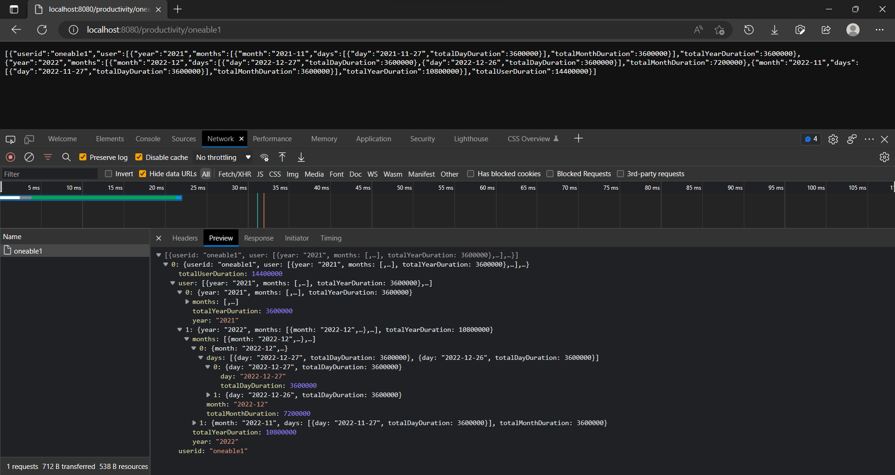

# oneable-backend

User Productivity Logs aggregation using mongodb and spring boot

## Mongodb
I created the below query in 5 stages to get the User complete productivity logs information segregated by years, months and days

__Sample mongo data__
- currentday - 27-12-2022 09:00:00 to 10:00:00
```
db.productivityLog.insertOne(
  {
    userid: 'oneable1',
    connectionStartTime: 1672111800000,
    connectionEndTime: 1672115400000,
    createdDate: ISODate("2022-12-27 09:00:00")
  }
)
```

- currentDay - 27-12-2022 10:00:00 to 11:00:00
```
db.productivityLog.insertOne(
  {
    userid: 'oneable1',
    connectionStartTime: 1672115400000,
    connectionEndTime: 1672119000000,
    createdDate: ISODate("2022-12-27 10:00:00")
  }
)
```

- previousDay - 26-12-2022 09:00:00 to 10:00:00
```
db.productivityLog.insertOne(
  {
    userid: 'oneable1',
    connectionStartTime: 1672025400000,
    connectionEndTime: 1672029000000,
    createdDate: ISODate("2022-12-26 09:00:00")
  }
)
```
- previousMonth - 27-11-2022 09:00:00 to 10:00:00
```
db.productivityLog.insertOne(
  {
    userid: 'oneable1',
    connectionStartTime: 1669519800000,
    connectionEndTime: 1669523400000,
    createdDate: ISODate("2022-11-27 09:00:00")
  }
)
```
- previousYear - 27-12-2021 09:00:00 to 10:00:00
```
db.productivityLog.insertOne(
  {
    userid: 'oneable1',
    connectionStartTime: 1640575800000,
    connectionEndTime: 1640579400000,
    createdDate: ISODate("2021-11-27 09:00:00")
  }
)
```
__Query__:
```
db.productivityLog.aggregate([
  {$match: {userid: "oneable1"}},
  {$group: {
    _id: {
      day: {$dateToString: {format: "%Y-%m-%d", date:"$createdDate"}},
      totalDayHours: {$sum: {$subtract: ["$connectionEndTime", "$connectionStartTime"]}},
      month: {$dateToString: {format: "%Y-%m", date:"$createdDate"}},
      year: {$dateToString: {format: "%Y", date: "$createdDate"}}
    }
  }},
  {$group: {
    _id: {
      month: "$_id.month",
      year: "$_id.year"
    },
    month: {$push: {day: "$_id.day", totalDayHours: "$_id.totalDayHours"}},
    totalMonthHours: {$sum: "$_id.totalDayHours"}
  }},
  {$group: {
    _id:{
      year: "$_id.year"
    },
    year: {$push: {month: "$_id.month", days: "$month", totalMonthHours: "$totalMonthHours"}},
    totalYearHours: {$sum: "$totalMonthHours"}
  }},
  {$group: {
    _id: "testoneable1",
    user: {$push: {year: "$_id.year", months: "$year", totalYearHours: "$totalYearHours"}},
    totalUserHours: {$sum: "$totalYearHours"}
  }}
])
```

## Spring boot:
- A basic spring boot project with spring web and spring mongo data dependencies
- Provided repository, service and controller classes to perform the crud operations on database.
- linked each operation with a rest api
- Created anothor custom repository for performing aggregation operations
- Provided the implementation for above repository by connecting to the mongo client and getting the database, collection.
- Generated the Java code from the mongo query for performing the above aggregation in java using the mongo compass aggregation export to langugage feature.
- Used the save code in the custom repository implementation to perform the aggregation in the database,
- To convert the document type which is received after performing the aggregation, i have used the mongoConvertor, then stored the result in the arrayList.

## Response
- GET http://localhost:8080/productivity/oneable1
